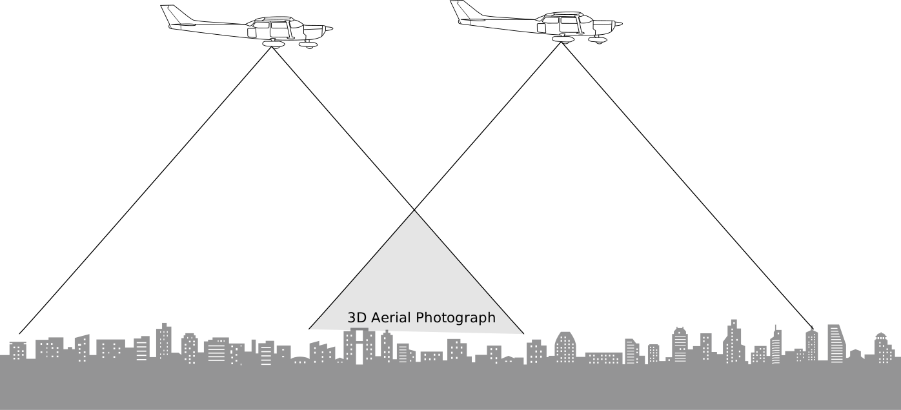
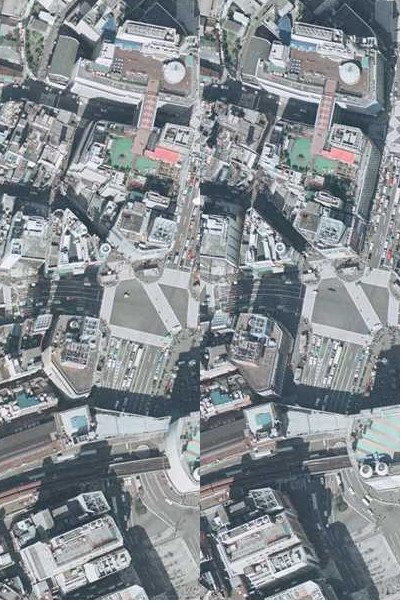

# 3D Aerial View from the Ark Sakura

3D Aerial Photograph Viewer suggested in [The Ark Sakura](https://en.wikipedia.org/wiki/The_Ark_Sakura)

[Demo](https://wak109.github.io/sakuramaru/)

## What is 3D Aerial Photograph

</img>

> Since aerial photographs are taken at fixed intervals -- one every ten seconds from a survey plane -- approximately three-fourths of the geographical features are successive photographs in sequence, therefore, and takeing advantage of the resulting parallax, you can make the sense stand out in three dimensions.

*The Ark Sakura*, Kobo Abe, translated by Juliet Winters Carpenter

## How to get yourself to see 3D Aerial Photograph

> Continue to focus intently, making fine adjustments in the distance between the photos as needed, and at some point you will hit on just the right arrangement: then magically the low-elevation places will drop away, and the high-elevation ones com thrusting up at you.

*The Ark Sakura*, Kobo Abe, translated by Juliet Winters Carpenter

Shibuya crossing, Tokyo, Japan

## What you will experience

> It goes beyond perspective; you would swear you were looking not at a photograph but at an exact replica of the scene. The impression of depth is in fact intensified so that in an urban area, the high-rise buildings and TV towers seem to jump up and threaten to stab you: in a mountain area it's the crags and treetops on the peaks. In the beginning, I would always find myself ducking or closing my eyes.

*The Ark Sakura*, Kobo Abe, translated by Juliet Winters Carpenter

#### *Note*
- *Source of Aerial Photographs:* [The web site of Japanese Geographical Survey Institute](https://mapps.gsi.go.jp/)
- Aerial photographs are retouched by [Sakukramaru](https://github.com/wak109/sakuramaru)